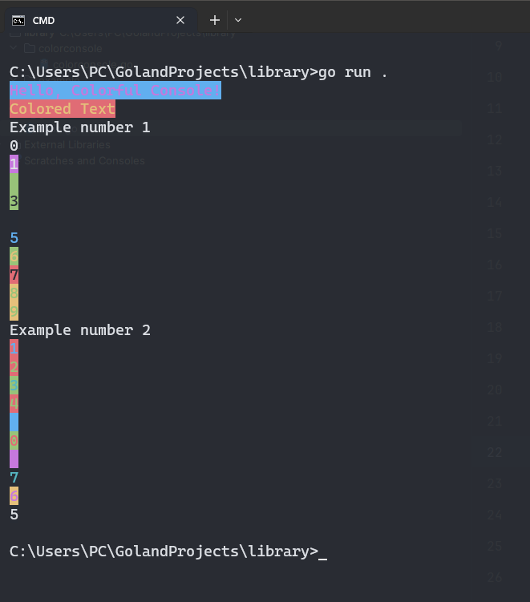

## ColorConsole Package

### Introduction

The ColorConsole package provides a simple Go library for printing colorful text to the console. It allows you to set text and background colors, providing a visually appealing display in the terminal.

### Usage

To use the ColorConsole package, import it into your Go code and use the provided functions to set text and background colors. The package is designed to work on both Windows and Unix-like systems.

``bash
go get github.com/KaynHvH/colorconsole
``
```go
package example

import (
	"fmt"
	"github.com/KaynHvH/colorconsole/colorconsole"
	"math/rand"
	"sync"
	"time"
)

func RunExample() {
	colorconsole.SetTextColor(colorconsole.Blue)
	colorconsole.SetBackgroundColor(colorconsole.Yellow)
	fmt.Println("Hello, Colorful Console!")
	colorconsole.ResetColor()
	coloredText := colorconsole.ColoredText("Colored Text", colorconsole.Green, colorconsole.Black)
	fmt.Println(coloredText)
}
```

### Example



In the example code, `example/example.go` demonstrates the usage of the ColorConsole package. It showcases how to set text and background colors, providing a visually appealing console output.
